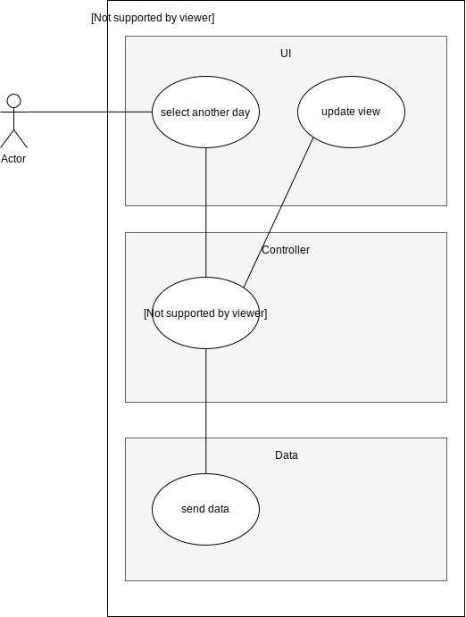

## Revision History
Date | Version | Description | Author
--- | --- | --- | ---
25.10.19 | 1.0 | First release of the UC | Kolja Groß
05.12.19 | 1.1 | Added Pre and Post conditions | Niclas Schmuck

## Table of Contents
- [1. Use Case Change Day](#1-use-case-create-account)
  - [1.1 Brief Description](#11-brief-description)
- [2. Flow of Events](#2-flow-of-events)
  - [2.1 Basic Flow](#21-basic-flow)
  - [2.2 Alternative Flows](#22-alternative-flows)
- [3. Preconditions](#4-preconditions)
- [4. Postconditions](#5-postconditions)

## 1. Use-Case Change Day
### 1.1 Brief Description
This use case is for updating the entries list after changing the day in the calendar.

## 2. Flow of Events
### 2.1 Basic Flow

#### 2.1.1 Activity Diagram
Will be added later on!
#### 2.1.2 Mock up

### 2.2 Alternative Flows
There are no alternative possible flows discussed. Only our Basic Flow should work.

## 3. Preconditions
1. The user has to be logged in
2. The call has to be sent by the android client
3. All required parameters should be given.

## 4. Postconditions
After sending request to the service the service should return all entries in database only for this day for this user. The client should sync this service with the local stored data.
