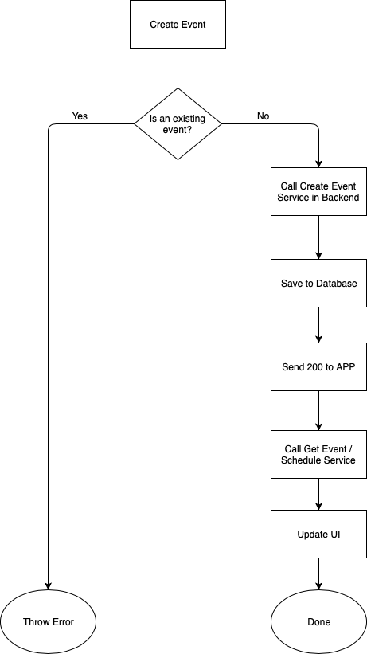
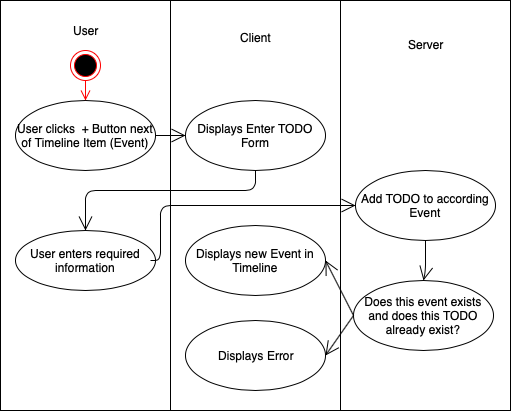

## Revision History
Date | Version | Description | Author
--- | --- | --- | ---
25.10.19 | 1.0 | First release of the UC | Kolja Groß

## Table of Contents
- [1. Use Case Create Account](#1-use-case-create-account)
  - [1.1 Brief Description](#11-brief-description)
- [2. Flow of Events](#2-flow-of-events)
  - [2.1 Basic Flow](#21-basic-flow)
  - [2.2 Alternative Flows](#22-alternative-flows)
- [3. Sepcial Requirements](#3-special-requirements)
- [4. Preconditions](#4-preconditions)
- [5. Postconditions](#5-postconditions)
- [6. Extension Points](#6-extension-points)

## 1. Use-Case Create Event
### 1.1 Brief Description
This use case is for creating new entries to the calendar, called events.

## 2. Flow of Events
### 2.1 Basic Flow

#### 2.1.1 Activity Diagram

#### 2.1.2 Mock up
tbd
### 2.2 Alternative Flows
n/a

## 3. Special Requirements
n/a

## 4. Preconditions
n/a

## 5. Postconditions
tbd

## 6. Extension Points
n/a
